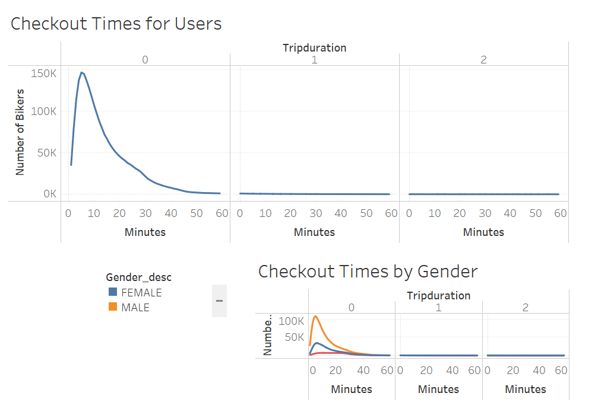
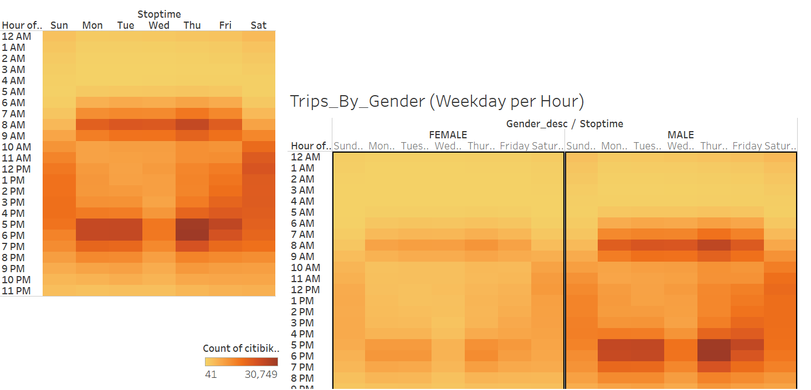
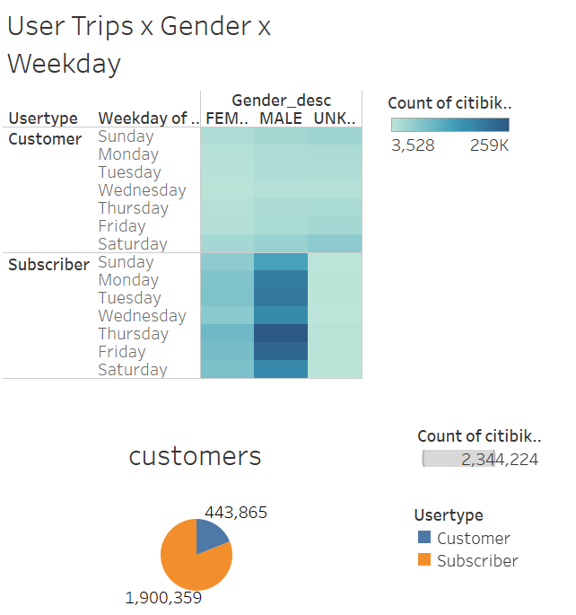
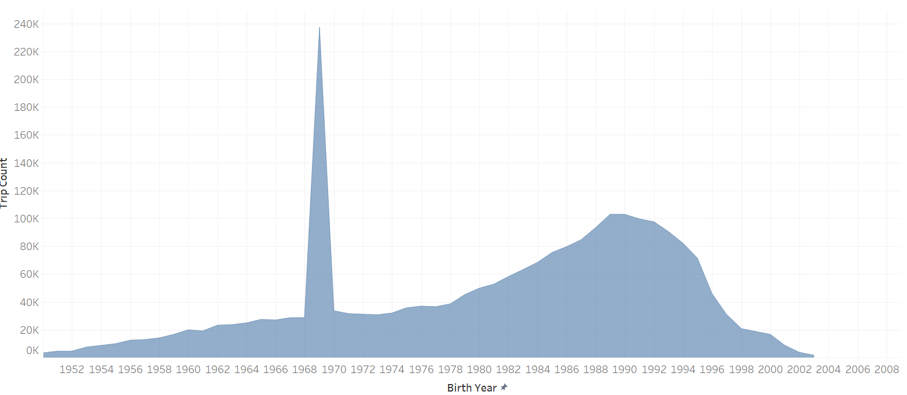

# DM BIKE

## Research overview
The purpose of this analysis was to explore a successful bike-sharing venture to learn more about the customer base and other consumer patterns. While CitiBike operates in a highly different built and demogrpahic environment, we may be able to use this initial fact-finding to further assess the potential of this transportation mode in Des Moines.  

## Results

Most users are using the service for relatively short trips - most are under 20 minutes according to this dataset. This will be important when considering how to place stations.  

Daily trips are clustered in 2 timeframes capping a workday suggesting commuting to be a primary use case.  

Males undertaking the subscription model are the overwhelming user. Hoe to target this market in Des Moines? What can we do to reach out, increase female users?  

User age tends to fall within 'late millenial' range. There may be an incorrect data point at 1968.  
